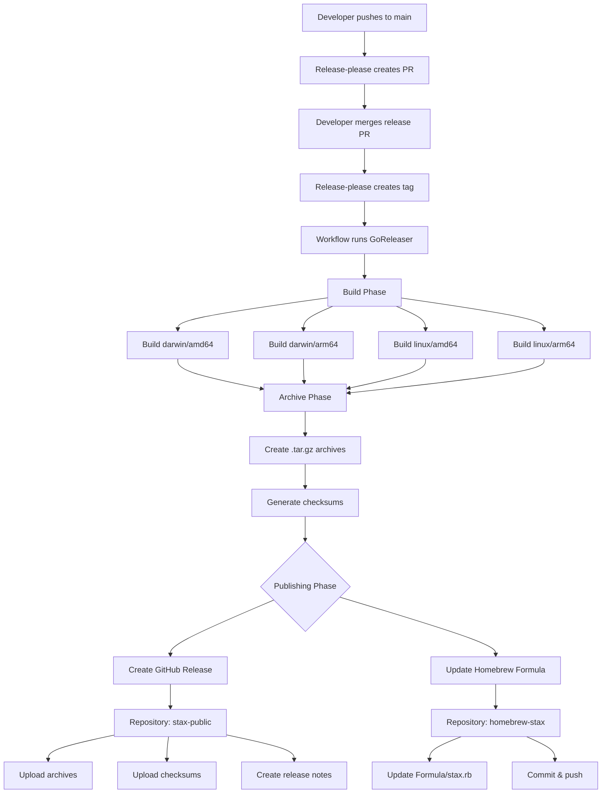

# Cross-Repository Release Flow

## Overview

This document explains how Stax releases work across multiple repositories.

## Repository Structure

```
Firecrown-Media/
├── stax (private)
│   ├── Source code
│   ├── .goreleaser.yml
│   └── .github/workflows/release-please.yml
│
├── stax-public (public)
│   └── GitHub Releases (binaries, archives, checksums)
│
└── homebrew-stax (public)
    └── Formula/stax.rb (Homebrew formula)
```

## Release Flow



## Token Usage

```
secrets.HOMEBREW_TAP_TOKEN
├── Used as GITHUB_TOKEN env var
│   └── GoReleaser uses for: Creating releases in stax-public
│
└── Used as HOMEBREW_TAP_TOKEN env var
    └── GoReleaser uses for: Updating formula in homebrew-stax
```

## Configuration Breakdown

### 1. Workflow (.github/workflows/release-please.yml)

```yaml
- name: Run GoReleaser
  env:
    GITHUB_TOKEN: ${{ secrets.HOMEBREW_TAP_TOKEN }}      # For stax-public
    HOMEBREW_TAP_TOKEN: ${{ secrets.HOMEBREW_TAP_TOKEN }} # For homebrew-stax
```

**Purpose:** Provides GoReleaser with authentication tokens

### 2. Release Configuration (.goreleaser.yml)

```yaml
release:
  github:
    owner: firecrown-media
    name: stax-public  # Releases go HERE
```

**Purpose:** Tells GoReleaser where to create releases
**Token Used:** `GITHUB_TOKEN` environment variable

### 3. Homebrew Configuration (.goreleaser.yml)

```yaml
brews:
  - repository:
      owner: Firecrown-Media
      name: homebrew-stax  # Formula goes HERE
      token: "{{ .Env.HOMEBREW_TAP_TOKEN }}"
```

**Purpose:** Tells GoReleaser where to publish Homebrew formula
**Token Used:** `HOMEBREW_TAP_TOKEN` from template variable

## Required Token Permissions

The `HOMEBREW_TAP_TOKEN` must have access to TWO repositories:

### Repository 1: Firecrown-Media/stax-public

**Why:** Create GitHub releases with binaries
**Permission:** Contents - Read and write
**Used by:** `release.github` section in .goreleaser.yml

### Repository 2: Firecrown-Media/homebrew-stax

**Why:** Update Homebrew formula file
**Permission:** Contents - Read and write
**Used by:** `brews[].repository` section in .goreleaser.yml

## What Gets Published Where

### stax-public Repository (GitHub Releases)

Each release includes:
- Binary archives (`.tar.gz`)
  - `stax_X.Y.Z_Darwin_x86_64.tar.gz`
  - `stax_X.Y.Z_Darwin_arm64.tar.gz`
  - `stax_X.Y.Z_Linux_x86_64.tar.gz`
  - `stax_X.Y.Z_Linux_arm64.tar.gz`
- Checksums file (`checksums.txt`)
- Release notes (from CHANGELOG)
- README, LICENSE, docs/

### homebrew-stax Repository (Formula)

Updates to: `Formula/stax.rb`

Contains:
- Download URLs (pointing to stax-public releases)
- SHA256 checksums
- Installation instructions
- Dependencies
- Test commands

## User Installation Flow

```
End User
├── Homebrew Installation
│   ├── brew install firecrown-media/tap/stax
│   ├── Homebrew reads: homebrew-stax/Formula/stax.rb
│   └── Downloads from: stax-public releases
│
└── Direct Download
    ├── Visit: github.com/firecrown-media/stax-public/releases
    └── Download: Binary archive for their platform
```

## Security Benefits

1. **Source Code Privacy**
   - Private repo (stax) keeps source code private
   - Public repo (stax-public) only has compiled binaries

2. **Minimal Token Scope**
   - Fine-grained PAT with access to only 2 specific repos
   - Only Contents permission (no admin, code access, etc.)
   - Can set expiration date

3. **Audit Trail**
   - All releases tracked in stax-public
   - All formula updates tracked in homebrew-stax
   - GitHub Actions logs show complete release process

## Common Issues

### Issue 1: 403 Resource not accessible by personal access token

**Cause:** Token missing access to stax-public repository
**Fix:** Add stax-public to token's repository access list

### Issue 2: Homebrew formula not updating

**Cause:** Token missing access to homebrew-stax repository
**Fix:** Add homebrew-stax to token's repository access list

### Issue 3: Wrong repository name

**Cause:** Case sensitivity in repository names
**Fix:** Ensure exact case matches (stax-public not Stax-Public)

## Verification Steps

After release, verify:

1. **Check release created:**
   ```bash
   gh release view v2.12.3 --repo Firecrown-Media/stax-public
   ```

2. **Check assets uploaded:**
   ```bash
   gh release view v2.12.3 --repo Firecrown-Media/stax-public --json assets
   ```

3. **Check formula updated:**
   ```bash
   gh api repos/Firecrown-Media/homebrew-stax/commits?path=Formula/stax.rb&per_page=1
   ```

4. **Test installation:**
   ```bash
   brew uninstall stax 2>/dev/null || true
   brew install firecrown-media/tap/stax
   stax --version
   ```

## Future Enhancements

Potential improvements to consider:

1. **Automated Testing**
   - Add smoke tests after release
   - Test Homebrew installation in CI
   - Verify binary signatures

2. **Release Notifications**
   - Slack/Discord notifications on release
   - Email notifications to team
   - Update documentation site automatically

3. **Multi-Platform Testing**
   - Test on actual macOS (ARM64 and x86_64)
   - Test on actual Linux distributions
   - Verify dependencies are correct

4. **Security Enhancements**
   - Sign binaries with GPG
   - Add SBOM (Software Bill of Materials)
   - Run security scans on releases
